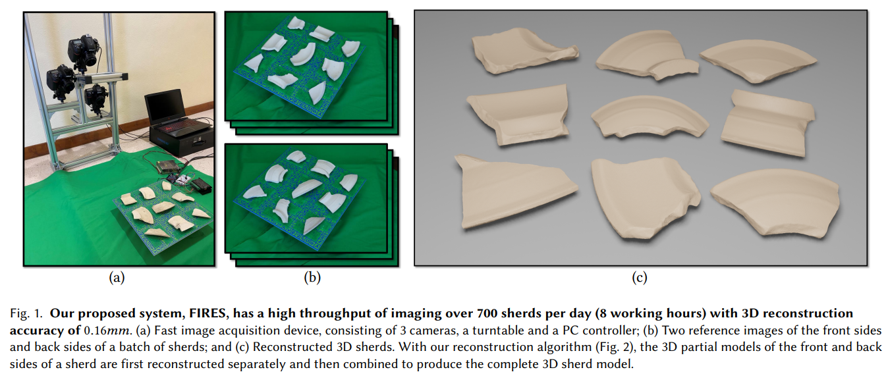

# FIRES
We propose a new system, dubbed FIRES, for high quality and high efficiency reconstruction of archaeological fragments,  which has a high throughput of imaging over 700 sherds per day (8 working hours) with 3D reconstruction accuracy of 0.16𝑚𝑚.




## [Project page](https://jiepengwang.github.io/FIRES/) |  [Paper](https:***) | [Data](https://connecthkuhk-my.sharepoint.com/:f:/g/personal/jiepeng_connect_hku_hk/Ejt8VJGsGVxIglpiLvW5Kr0BzC3SLCnWrbDn-CRAKBXplw?e=PneWj7)

Code is coming soon...

## Citation

Cite as below if you find this repository is helpful to your project:

```
@article{wang2022fires,
      	title={FIRES: Fast Imaging and 3D Reconstruction of Archaeological Sherds}, 
      	author={Wang, Jiepeng and Zhang, Congyi and Wang, Peng and Li, Xin and Cobb, Peter J. and Theobalt, Christian and Wang, Wenping},
	journal={arXiv preprint},
      	year={2022}
}
```