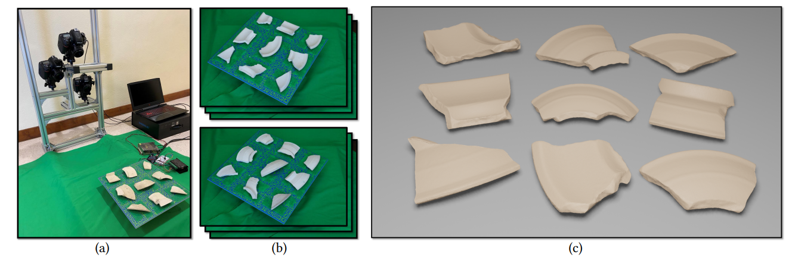

# Batch-based Model Registration for Fast 3D Sherd Reconstruction (ICCV2023)
In this work, we aim to develop a portable, high-throughput, and accurate reconstruction system for efficient digitization of fragments excavated in archaeological sites. To realize high-throughput digitization of large numbers of objects, an effective strategy is to perform scanning and reconstruction in batches. We show that our batch-based scanning and reconstruction pipeline can have a high throughput of imaging over 700 sherds per day (8 working hours) with 3D reconstruction accuracy of 0.16𝑚𝑚.




## [Project page](https://jiepengwang.github.io/FIRES/) |  [Paper](https://arxiv.org/abs/2211.06897) | [Data](https://connecthkuhk-my.sharepoint.com/:f:/g/personal/jiepeng_connect_hku_hk/Ejt8VJGsGVxIglpiLvW5Kr0BzC3SLCnWrbDn-CRAKBXplw?e=PneWj7)


## Usage

#### Dataset
Multi-view images of fragments used in the paper can be downloaded from [here](https://connecthkuhk-my.sharepoint.com/:f:/g/personal/jiepeng_connect_hku_hk/Ejt8VJGsGVxIglpiLvW5Kr0BzC3SLCnWrbDn-CRAKBXplw?e=PneWj7).
The data is organized as follows:
```
<batch_name>
|-- top_images
    |-- cam1_image001.tif  # image for each view
    |-- cam1_image002.tif
    ...
|-- top_masks
    |-- cam1_image001.png  # mask for each view
    |-- cam1_image002.png
    ...
|-- bottom_images
    |-- cam1_image001.tif  # image for each view
    |-- cam1_image002.tif
    ...
|-- bottom_masks
    |-- cam1_image001.png  # mask for each view
    |-- cam1_image002.png
    ...
```


### Setup
First, create a python environment. Then, compile the dependencies. More details to configure the running environment can be found [here](https://github.com/jiepengwang/FIRES/blob/main/conf/README.md).


### Test
```
python main_piecereg.py --dir_batch [Dir_Batch] --dir_gt [Dir_GT]
```


## Citation

Cite as below if you find this repository is helpful to your project:

```
@inproceedings{wang2023sherd,
  title={Batch-based Model Registration for Fast 3D Sherd Reconstruction},
  author={Wang, Jiepeng and Zhang, Congyi and Wang, Peng and Li, Xin and Cobb, Peter J and Theobalt, Christian and Wang, Wenping},
  booktitle={Proceedings of the IEEE/CVF International Conference on Computer Vision},
  pages={14519--14529},
  year={2023}
}
```
